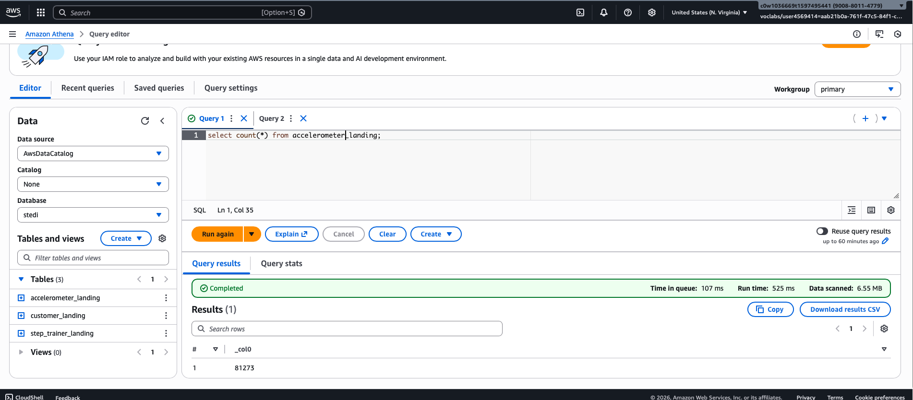
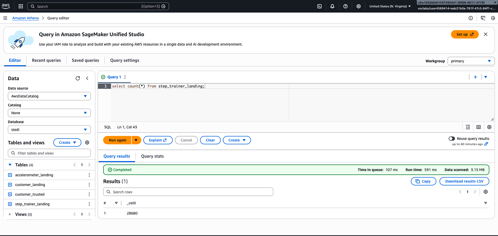
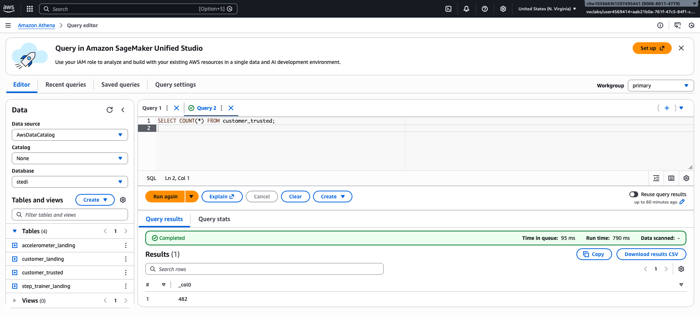
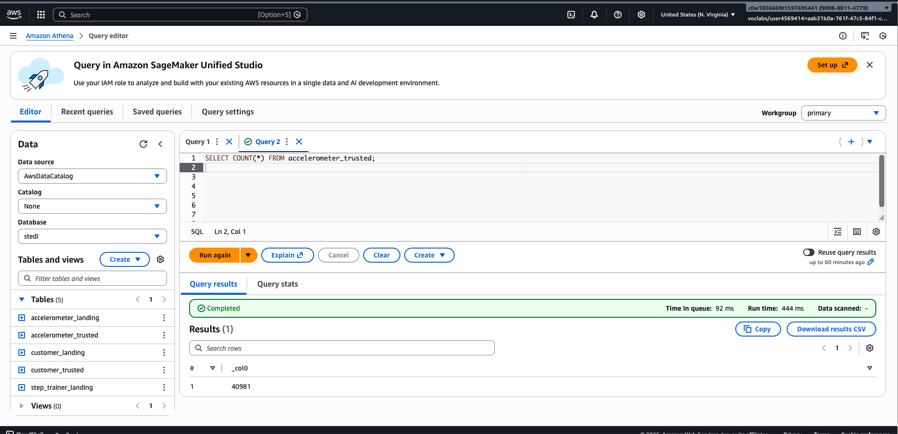
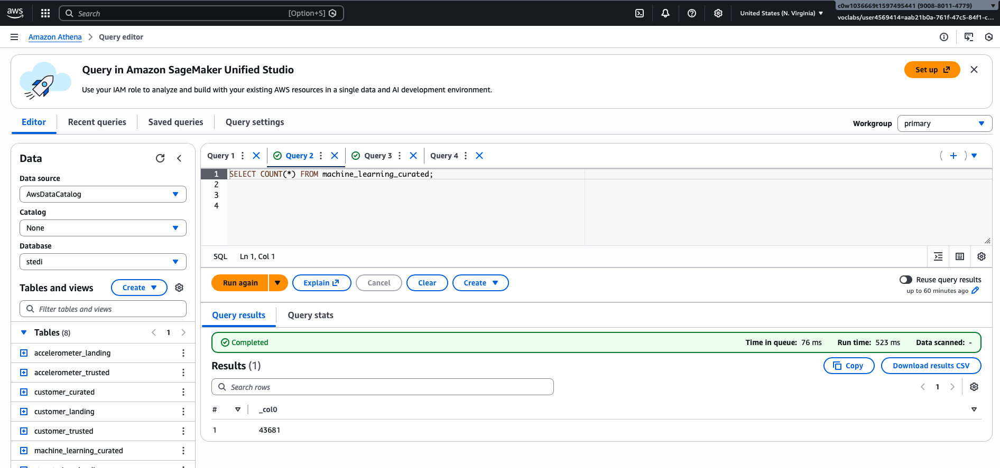

# D609 – STEDI Human Balance Analytics (Udacity)

This project sets up an AWS Glue ETL pipeline that takes raw JSON data from Amazon S3, adds privacy filters and updates the schema, and then creates datasets ready for analytics and machine learning.

The solution uses a Landing to Trusted to Curated data lake architecture with the following tools:
- Amazon S3  
- AWS Glue Studio  
- AWS Glue Data Catalog  
- Amazon Athena

## Landing Zone

### Glue Jobs
These Glue jobs read data from the S3 landing locations:

`customer_landing_to_trusted.py`
`accelerometer_landing_to_trusted.py`
`step_trainer_landing_to_trusted.py`

### SQL Landing Tables
These SQL DDL scripts were used to create landing tables in the Glue Console:e:

`sql/customer_landing.sql`  
`sql/accelerometer_landing.sql`  
`sql/step_trainer_landing.sql`

All JSON fields from input files are included and appropriately typed.

### Athena Validation — Landing Zone

#### customer_landing


Count: **956 rows**  
The customer_landing table contains rows with blank `shareWithResearchAsOfDate`.

#### accelerometer_landing


Count: **81,273 rows**

#### step_trainer_landing


Count: **28,680 rows**

## Trusted Zone

### Glue Jobs with Dynamic Catalog Updates
These trusted jobs are configured to dynamically update the Glue Catalog schema:

`customer_landing_to_trusted.py`  
`accelerometer_landing_to_trusted.py`  
`step_trainer_trusted.py`

These jobs include:

```python
enableUpdateCatalog=True
updateBehavior="UPDATE_IN_DATABASE"
```

### Athena Validation - Trusted Zone

#### customer_trusted


Count: **482 rows**  
There are no rows with blank `shareWithResearchAsOfDate`.

#### accelerometer_trusted


Count: **40,981 rows**

#### step_trainer_trusted


Count: **14,460 rows**

## Curated Zone

### customer_curated

**Glue Job:** `customer_trusted_to_curated.py`  
This performs an inner join between `customer_trusted` and `accelerometer_trusted` on customer email and outputs only customer columns.

#### Athena Validation


Count: **482 rows**


### machine_learning_curated

**Glue Job:** `machine_learning_curated.py`  
This performs an inner join between `step_trainer_trusted` and `accelerometer_trusted` using matching timestamps.

#### Athena Validation


Count: **43,681 rows**


## Repository Structure

```
D609-STEDI-Udacity/
├── glue_jobs/
│   ├── customer_landing_to_trusted.py
│   ├── accelerometer_landing_to_trusted.py
│   ├── step_trainer_trusted.py
│   ├── customer_trusted_to_curated.py
│   └── machine_learning_curated.py
├── sql/
│   ├── customer_landing.sql
│   ├── accelerometer_landing.sql
│   └── step_trainer_landing.sql
├── screenshots/
│   ├── customer_landing.png
│   ├── accelerometer_landing.png
│   ├── step_trainer_landing.png
│   ├── customer_trusted.png
│   ├── accelerometer_trusted.png
│   ├── step_trainer_trusted.png
│   ├── customer_curated.png
│   └── machine_learning_curated.png
└── README.md
```


